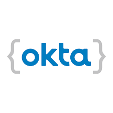

# Okta User Migration Script



## Overview

This project can be used to migrate users to Okta using their API.
It's a lightweight and customizable script written in JavaScript which uses Node and npm.

After cloning and opening the project, run the following command to install the dependencies:

```
npm install
```

## Adding configuration details

Edit the `.env` file to add your API details.

## Adding users to migrate

The `users.json` file contains the users you want to migrate. This would likely be an export of users from the 
original environment. This project contains a couple test users as an example.

## Running the script

This script reads the `users.json` file and imports the users into Okta.

To begin the import:

```
npm start
```

Check the `log` directory for success and error messages.